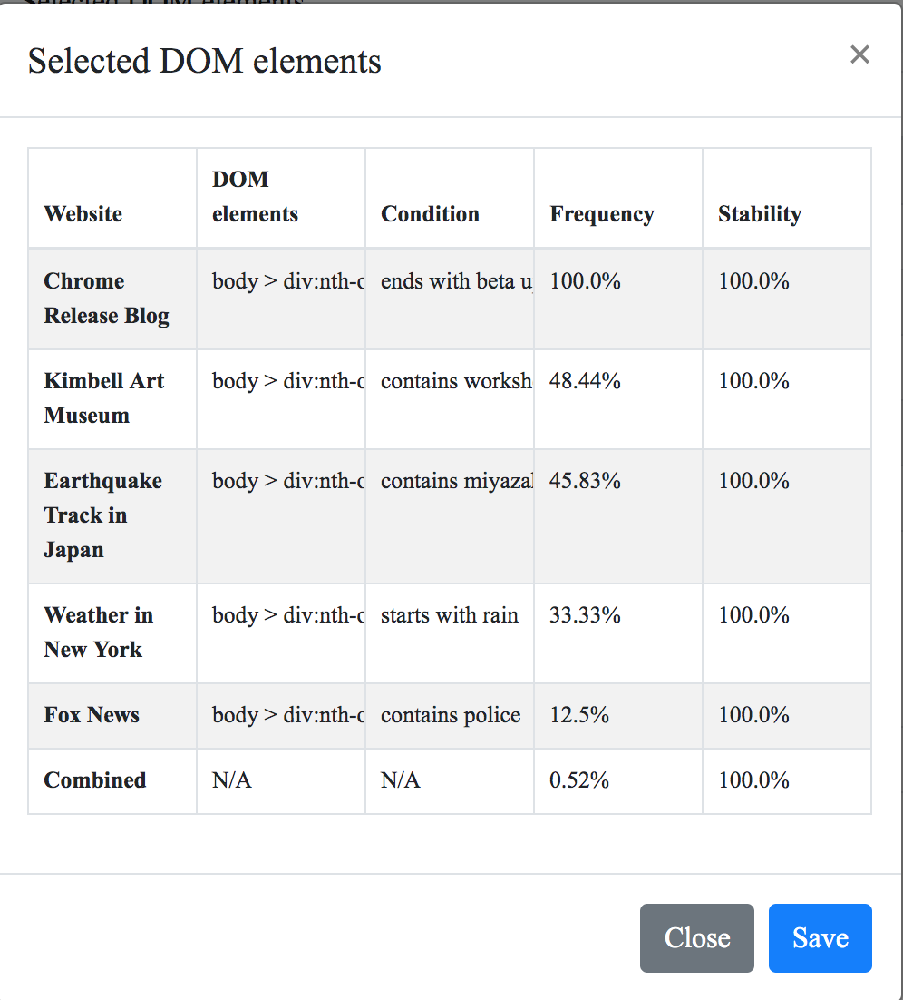

# Evil Mastermind

This repo contains the code from *EVIL MASTERMIND: Delivering Malicious Payloads via Innocent Actors*.

## Quick start

### Usage

```
usage: mindgen.py [-h] [-i payload] [-f filename] [-o filename] [-v level]

optional arguments:
  -h, --help            show this help message and exit
  -i payload, --input payload
                        feed malicious payload via command line, e.g. -i "rm -rf file"
  -f filename, --file filename
                        feed malicious payload via file, e.g. -f payload.php
  -o filename, --output filename
                        output filename
  -v level, --verbose level
                        display more messages, default=0, verbose=1, debug=2
```

### Quick example

By running `mindgen.py -i "exec('rm -rf test');"`, an Evilmind instance (`evilmind.php`) will be generated, execute it and it will simply print either a malicious payload or benign content according to the crawled content. In production, replace the `echo` at the end of `evilmind.php` with `exec`, `system`, `shell_exec`, etc., but be careful, it can cause huge damage!

## Basic Workflow

### 1. Dataset Preparation

To crawl these websites regularly, you can leverage [cron](https://en.wikipedia.org/wiki/Cron), for example, to make it crawl every 30 minutes, use `*/30 * * * * bash /path/to/crawl_websites.sh`

we have already provided some crawled data to play with (May 10, 2019 - May 13, 2019, crawls every 30 minutes) in `evil-mastermind/actor_profiler/crawled_dataset`, including

* [Chrome Release Blog](https://chromereleases.googleblog.com/)
* [Fox News](https://www.foxnews.com/)
* [Weather in New York](https://weather.com/weather/tenday/l/New+York+NY+10010:4:US)
* [Earthquake Track in Japan](https://earthquaketrack.com/r/east-coast-of-honshu-japan/recent)
* [Kimbell Art Museum](https://kimbellart.org/events)

### 2. Actor Profiler

Run actor profiler by run the script [run_actor_profiler.sh](run_actor_profiler.sh)

#### Homepage
Visit `localhost:5000` in the browser to see the homepage of actor profiler, in the homepage you can see a set of websites under different categories.


* by clicking the add button in the first column, you can add website under that category;


* by clicking the edit button, you can change the details of the website; 


* by clicking the name of the website, you will go to the details of the website.

#### Details of website


The details page aims to help you understand the content of website and decide the attack-triggering input. The page contains two parts, a table and a DOM tree. First, the table contains the possible DOM elements with their condition and corresponding frequency and stability, you can add DOM elements by clicking the add button in the first column; second, the DOM tree is extracted from the crawled website, it shows the structure of the website and is annotated with the most frequent word in that elements together with the frequency and stability.    
The definition of frequency and stability is elaborated in the paper.

You can choose the element you want by selecting the checkbox in the table. To check the already chosen elements, click `Selected DOM elements` in the navigation bar, it will also show the synthetic frequency and stability of all the chosen elements. Click `Save` and the attack will be saved to `evil-mastermind/actor_profiler/attacks` as JSON format.    




### 3. MindGen

Provide payload by `-i` via command line or `-f` via file, run `mindgen.py` to create EvilMind malware.

## Configuration

see [config.yaml](config.yaml).

## Requirements

* General requirements
  * [Graphviz](https://www.graphviz.org/)
  * Python 3.6+

* Requirements of Python packages  
see [requirements.txt](requirements.txt).


